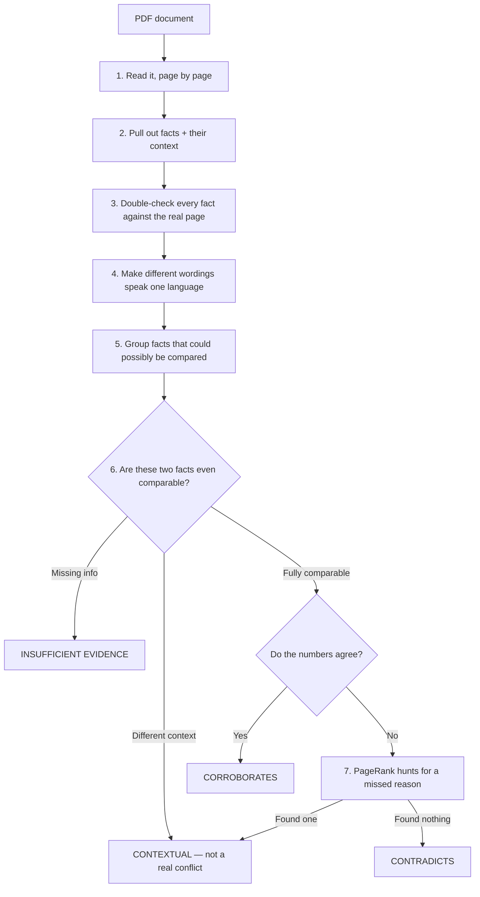
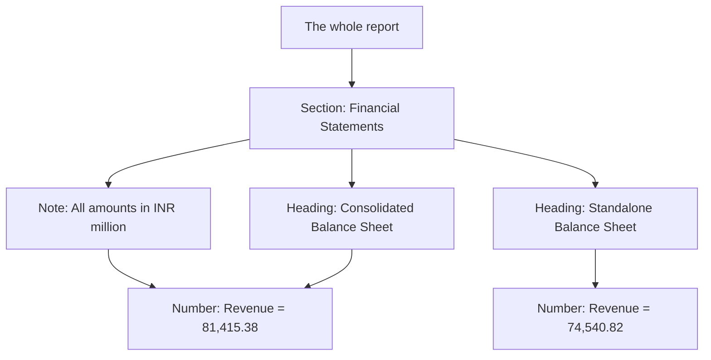
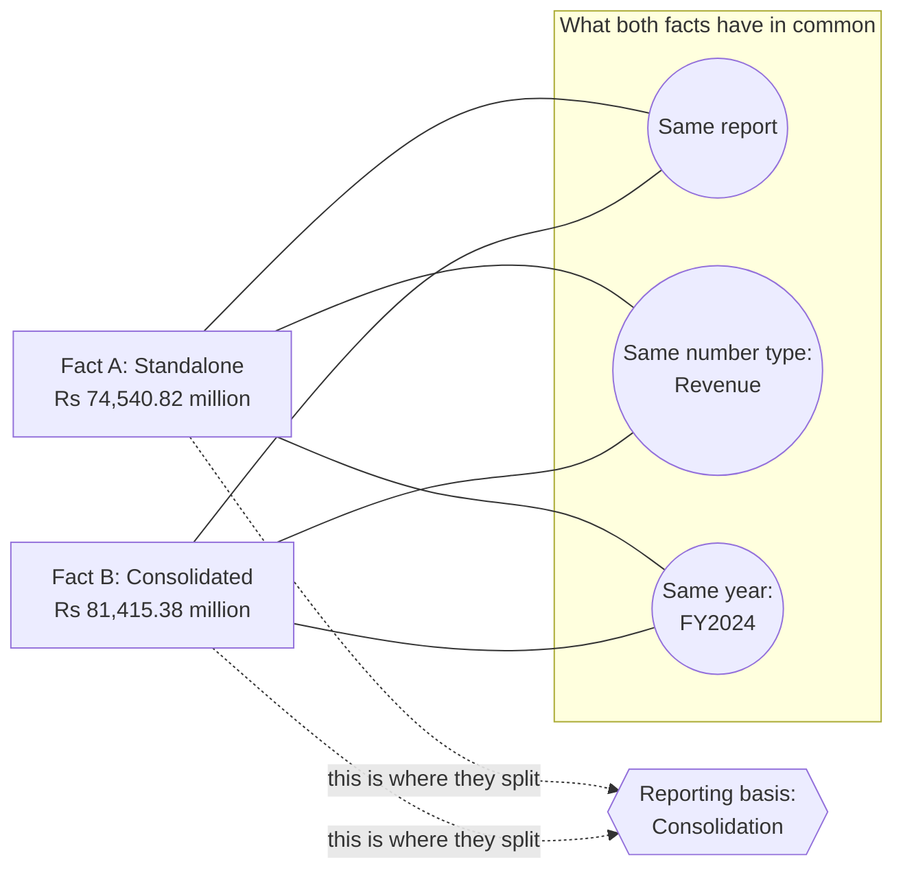
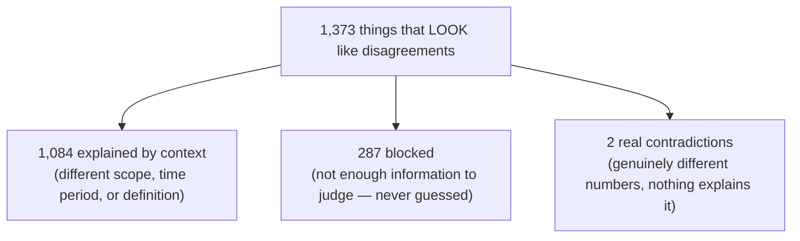

# Fact Knowledge Layer

## Two documents just gave you two different numbers. Which one is lying?

### Neither one. You asked the wrong question.

> ## "Don't ask whether two facts contradict. Ask whether they are comparable at all."

That single sentence is the whole idea. Everything in this project exists to
turn that sentence into something a computer can actually check, step by
step, instead of just something clever to say.

**In plain words: this system reads PDFs, pulls out every fact it can find,
and then figures out whether two facts truly disagree — or whether they were
just never answering the same question.** And to do the hardest part of that
job, it uses **PageRank** — yes, the same algorithm Google used to rank
websites — but pointed at a completely different problem than the one it was
built for.

No chopping documents into random chunks. No "these two sentences sound 87%
similar, so they must mean the same thing." No AI model quietly deciding
who's right. Just facts, proof, a graph, and an algorithm that knows where to
look.

<sub>Python 3.13 · FastAPI · SQLite · 272 tests passing · 16/16 correct on the hand-checked test set · 79% of apparent conflicts explained away</sub>

---

## The big picture, in one diagram



Seven steps. The first five just get the facts ready. Step six is the actual
brain of the system — a set of rules, not a guess. Step seven is where
PageRank comes in, and it only gets called when something looks like a real
fight between two documents.

---

## The problem, in plain terms

Say a company's annual report says its revenue was **₹74,540.82 million**.
Its investor presentation says **₹8,142 crore**. A government report says the
economy grew **6.5%**. The IMF says **6.6%** for the very same year.

The lazy answer is "one of these must be wrong." Almost always, **neither
is**. One revenue number is for the company alone; the other includes its
subsidiaries. One growth number is an early estimate; the other came out
later, after more data was in.

Most "AI fact-checking" tools get this wrong at the very first step. They cut
documents into small pieces, turn each piece into a number (an "embedding"),
and ask an AI model whether two pieces "sound similar." That approach is
broken from the start, because **the detail that tells two numbers apart is
almost never sitting next to the number.** It's in a heading two lines above.
It's in a footnote. It's in a column title. Chop the document into pieces and
that detail is the first thing you throw away — and once it's gone, no AI
model can guess it back.

---

## How it works, step by step

**Step 1 — Read the page, not the whole book at once.**
The PDF is read one page at a time, never all at once. Feeding an AI model
500 pages in a single go is a well-known way to get a confident, wrong
answer — models tend to "forget" things buried in the middle of a huge wall
of text. So instead, the system first builds a simple map of the document —
which section a page belongs to, what heading is above it, what note applies
to it — and only then asks the model to read the page, **with that map
attached.**



The bare number `81,415.38` means nothing on its own. But by the time the
system reaches it, it already knows the number is in millions of rupees and
on a *consolidated* basis — because that's what the map above it says. That's
the whole trick of this step: **the meaning travels down to the number, the
number doesn't have to explain itself.**

**Step 2 — Don't take the AI's word for it.**
Every fact the model finds has to point to the *exact sentence* it came from.
The system then checks: does that sentence really exist on that page? Does
the number really appear inside it? If either check fails, the fact is set
aside as "unverified" — never thrown away, never quietly kept either. This
is what catches a model that read a number correctly but **made up where it
found it.**

**Step 3 — Get everyone speaking the same language.**
`Acme Ltd.` and `Acme Limited` become the same company. `crore`, `lakh`,
`million` and `billion` all convert to one common scale. `FY24`,
`2023-24`, and "year ended March 31, 2024" all become the same time period.
Nothing gets compared until both sides are speaking the same language — and
one rule is never broken: **currencies are never converted using a guessed
exchange rate.** A number in dollars and a number in rupees are simply marked
"can't compare," rather than silently faked into agreement.

**Step 4 — Don't compare everything to everything.**
Checking every fact against every other fact would be painfully slow and
mostly pointless. So facts are first grouped by "same company, same kind of
number" — a fact about Delhivery's revenue never even gets near a fact about
India's GDP.

**Step 5 — The rulebook decides, not the AI.**
This is the actual decision-maker, and it is **plain, boring, predictable
code** — no AI model, no guessing, no "vibes." It checks, in order: is
something important missing on either side? Do the two facts disagree on
*any* relevant detail? Is the time period the same? Only after all of that
does it even look at whether the numbers match. And the answer is never a
flat "yes/no" — it's always one of:

- ✅ **CORROBORATES** — same fact, same answer
- 🔀 **CONTEXTUAL** — different answer, but for a good reason, *named exactly*
- ⚠️ **INSUFFICIENT EVIDENCE** — can't tell, and here's what's missing
- ❌ **CONTRADICTS** — genuinely disagree, no good reason found

**Step 6 — PageRank, when a real fight breaks out.**
*(This is the interesting part — its own section is coming up.)*

**Step 7 — Time is not the same as truth.**
Facts like "who holds this job" or "what's the company's address" aren't
numbers — they're **true for a stretch of time, then they change**. The
system keeps track of two separate clocks: when something was *actually
true*, and when a document *said* it was true. That's what tells the
difference between "these two documents contradict each other" and "this
person's job simply ended and someone else's began" — a **handover**, not a
conflict.

---

## 🔥 PageRank — an old algorithm, doing a brand-new job

Here's the one part of this project that doesn't come from a textbook.

**Quick refresher on the original idea:** Google ranked web pages by
pretending a person is randomly clicking links forever. A page that keeps
getting landed on — because lots of other important pages link to it — must
be important. That's PageRank in one sentence.

**This project asks a completely different question with the same trick:**
instead of "which web page is important," it asks **"which piece of context
actually explains why these two facts don't match?"**

That single idea is used to solve **two separate hard problems.**

### Problem 1: Out of everything these two facts could differ on, which ONE thing actually matters?

Two facts about the same number can differ in a dozen small ways at once —
time period, scope, currency, rounding, and so on. Most of those are things
the two facts **agree on** — that's exactly *why* they were compared in the
first place. The real question is: **which single detail is the one place
they actually split?**

Here's how PageRank answers that. The system builds a small map — a graph —
connecting each fact to everything around it: its document, its section, its
time period, every extra detail attached to it. Then it runs **two random
walks** over that map at once — one starting from Fact A, one starting from
Fact B — each one behaving like that same "random clicker" from Google's
original idea, except this one always wanders back to where it started.



Both walks agree strongly on "same report," "same number type" and "same
year" — which makes sense, since that's why the two facts were even placed
side by side. But only **one** thing splits them: whether the number is
*standalone* or *consolidated*. The system measures two things for every
piece of context:

- **How much both walks agree it matters** (called *connection*)
- **How much the two walks disagree about it** (called *divergence*)

Something is only flagged as the real reason for a mismatch when it scores
high on **both** — strongly connected *and* strongly divergent. A detail both
facts already agree on can be as central as you like; it still can't be the
reason they disagree, and the math says so automatically.

**Does it actually work? Yes — measured, not guessed.** Tested on the same
twelve tricky cases, comparing runs with and without this step, using the
exact same number of AI calls either way: **without it, 5 apparent conflicts
got correctly explained away and 5 stayed as unresolved contradictions. With
it, 8 got explained away and only 2 stayed unresolved.** Same cost. Just
smarter about what gets checked first.

### Problem 2: The document actually explained this — where on the page do I even look?

Here's an uncomfortable finding from testing this on real documents:
**almost every "contradiction" the system first found wasn't a real
disagreement at all.** The explanation was sitting right there on the page —
in a footnote, a row label, a small note — and the AI simply missed it while
reading.

So before the system ever reports a real contradiction, it goes back for a
second look. But telling an AI "go re-read this whole page and see if you
missed something" is vague, slow, and easy to get wrong. **AI models do
much better when told exactly what to look for.**

This is PageRank's second job — using the exact same walk from Problem 1.
Instead of only ranking *known categories* of context, it also ranks
**individual words** from the evidence — scoring highest the words that
appear near one fact and not the other. So instead of handing the AI two
entire pages and hoping for the best, the system hands it a short list:
*"Check for anything related to `adjusted`, `generated`, `operations` — these
words only show up on one side."* That turns a vague "find the difference"
task into pointing directly at the clue.

**And here's the one rule that never gets broken:** PageRank is only ever
allowed to **suggest where to look.** It can never change a number, never
decide a verdict, and never make a contradiction disappear on its own. The
final decision always goes back through the same plain rulebook from Step 5.
If PageRank points at the wrong thing, the system just wastes one extra
check — it can **never** produce a wrong answer because of a bad ranking.
That guarantee isn't just a promise in this document — it's an actual
automated test in the codebase that fails the build if it's ever broken.

**Want the full math?** Every formula, every weight, and the exact algorithm
are written out in **[`docs/ENGINEERING.md`](docs/ENGINEERING.md)** for anyone
who wants to see precisely how it works under the hood.

---

## What actually came out of this

Run across six real documents — company filings and government economic
reports:



| | |
|---|---|
| Facts pulled out and double-checked | **666** out of 797 tried (**83.6%**) |
| Facts set aside as unverified, each with a reason | 131 |
| Pairs of facts actually compared | 1,505 |
| **Things that looked like a disagreement** | **1,373** |
| → explained away by a named, real reason | **1,084** |
| → blocked — too little information to judge | 287 |
| → **left as a genuine, unexplained contradiction** | **2** |
| **Bottom line: how many "conflicts" turned out to be fake** | **79%** |
| Contradictions raised, then correctly taken back on a second look | 8 |
| New categories of "reason for disagreement" the system figured out on its own | 11 found, 7 confirmed as real |
| Score on the hand-checked answer key | **16 / 16** |

Every number above is one command away, using the finished example database
that ships with this project — no account, no API key needed:

```bash
cd backend
FKL_DB_URL=sqlite:///data/snapshot.sqlite python -m fkl.cli relate
```

<sub>Running this writes a fresh copy of the results into that file, so
`git status` may show it as changed afterward — nothing is lost or
overwritten, and `git checkout data/snapshot.sqlite` puts it back exactly as
it was.</sub>

**The whole point of this project can be summed up in one line: success isn't
measured by how many conflicts it finds. It's measured by how many fake
conflicts it correctly throws out.**

---
## Getting started

### 1. Requirements

Python **3.11+** (developed on 3.13). That's the whole list.

No database server, no vector store, no message queue, no Node, no build step
for the interface. The store is a single SQLite file and the interface is plain
HTML and JavaScript served by the same process as the API.

### 2. Install

```bash
git clone <this-repo>
cd SuperJoin

python -m venv .venv
source .venv/bin/activate           # Windows: .venv\Scripts\activate

pip install -r backend/requirements.txt
```

### 3. Start the service

The API and the interface are **one process on one port**. There is nothing to
build, nothing to serve separately, and no CORS to configure:

```bash
cd backend
python -m fkl.cli serve
```

```
  UI   http://127.0.0.1:8000/
  API  http://127.0.0.1:8000/api/v1/corpus
  docs http://127.0.0.1:8000/docs
```

Open **http://127.0.0.1:8000/** and the interface is there.

| Flag | Default | |
|---|---|---|
| `--host` | `127.0.0.1` | bind address — use `0.0.0.0` to reach it from another machine |
| `--port` | `8000` | |
| `--reload` | off | restart on code changes, for development |

<sub>**How the interface gets served.** `fkl serve` mounts the folder
`PDF Fact Reconciliation System/` at `/` and serves `Reconcile.dc.html` as the
index. It's a single-page app with two plain script files beside it — no npm
install, no bundler, no dist folder. The only requirement is that the folder
stays next to `backend/` where it is in the repository; if it's missing, the
server logs a warning and serves the API alone.</sub>

### 4. See it working — with no API key at all

A pre-computed database ships with the repository, so you can explore the whole
system — every screen, every verdict, every piece of evidence — before setting
up any credentials and without spending anything:

```bash
cd backend
FKL_DB_URL=sqlite:///data/snapshot.sqlite python -m fkl.cli serve
```

Open **http://127.0.0.1:8000/** and every screen is populated.

This is a *live* database, not a set of screenshots. The page text is kept, so
the comparability gate, the interval engine and the deterministic scouts all
re-run against it and produce the same numbers with no key:

```bash
FKL_DB_URL=sqlite:///data/snapshot.sqlite python -m fkl.cli relate
```

**Start here.** It's the fastest way to understand what the system does, and it
costs nothing.

### 5. Add your API key

Only extraction needs a model. Everything else — the gate, the interval engine,
canonicalization, the deterministic scouts — runs without one.

```bash
cp .env.example .env
```

Then open `.env` and fill in:

```ini
OPENAI_API_KEY=sk-...

FKL_MODEL_EXTRACT=gpt-4.1-mini              # one call per page: favour cost
FKL_MODEL_REASON=gpt-4.1                    # rare calls: favour capability
FKL_MODEL_EMBED=text-embedding-3-small      # alias and metric matching
FKL_DB_URL=sqlite:///data/fkl.sqlite        # where the store lives
```

`.env` is gitignored and must never be committed. Check the key works:

```bash
cd backend
python -m fkl.cli models --prefix gpt
```

### 6. Run it on your own PDFs

Restart the service so it picks up the key, then use the interface:

```bash
cd backend
python -m fkl.cli serve
```

Go to **Add documents** → drop in a folder of PDFs (or pick files) → set how
many pages per document to read → **Ingest**.

Ingest, extraction and a corpus-wide comparison then run behind a job whose
progress bar, live page counter and log you can watch as it happens. When it
finishes, every other screen refreshes with the new corpus.

> **A note on cost and time.** Extraction is the only part of this system that
> spends money: one structured model call per page, six pages in flight at a
> time. **Start with a small page cap** — 10 or 20 — to see the whole pipeline
> run in a couple of minutes. The page cap exists so an unattended upload of a
> 400-page filing can't spend on its own.

The comparison at the end runs over the **whole corpus**, not just what you
uploaded — because the value of a new document is what it agrees and disagrees
with.

Re-uploading a PDF already in the store is recognised by content hash and
reused rather than re-ingested. A scanned PDF with no text layer is named and
skipped rather than failing the batch.

### Or use the command line

```bash
cd backend

# 1. Ingest. --no-llm does layout analysis only: no key, no spend.
python -m fkl.cli ingest ../path/to/*.pdf --no-llm

# 2. See a page exactly as the extractor will see it, and as the PDF stores it.
python -m fkl.cli page 1 12
python -m fkl.cli page 1 12 --raw

# 3. Extract facts (needs a key). Page ranges keep iteration cheap.
python -m fkl.cli ingest ../path/to/*.pdf
python -m fkl.cli extract 1 --pages 0-19

# 4. Compare everything, with the second look enabled.
python -m fkl.cli relate --review

# 5. Look at the results.
python -m fkl.cli report
python -m fkl.cli docs
python -m fkl.cli export 1 -o ../out/doc1.json
```

Extraction is **idempotent by page** — re-running skips pages that already have
claims, so a repeat costs nothing and can't create duplicates. `--force` redoes
them properly, replacing rather than appending.

### Command reference

| Command | What it does |
|---|---|
| `ingest` | Parse, profile and store PDFs. `--no-llm` for layout only |
| `page` | Print one page as the extractor sees it (`--raw` for the source text) |
| `extract` | Extract, ground and store claims. `--pages`, `--force` |
| `relate` | Run the comparability gate over the corpus. `--review` for the second look |
| `as-of` | Time-travel: what was true on a given date |
| `gold` | The hand-labelled evaluation set. `--verify`, `--score` |
| `report` | Extraction quality across the corpus |
| `export` | Dump a document and its claims as JSON |
| `snapshot` | Rebuild the shippable database |
| `serve` | Run the UI and the API together |
| `models` | List the model ids your key can actually see |

### The API

The UI and the API are one process on one port, so there's no CORS setup and
nothing to configure. **http://127.0.0.1:8000/docs** gives the full OpenAPI
surface if you'd rather read the data than the screens.

```bash
# Upload a folder and watch the job
curl -F files=@a.pdf -F files=@b.pdf \
     "http://127.0.0.1:8000/api/v1/documents?maxPages=20"
curl http://127.0.0.1:8000/api/v1/jobs/1

# Ask a question in English
curl "http://127.0.0.1:8000/api/v1/ask?q=..."

# Re-run one comparison with an axis held out of the reasoning
curl -X POST http://127.0.0.1:8000/api/v1/compare \
     -d '{"a": "f-1", "b": "f-2", "mask_axes": ["consolidation"]}'
```

---

## The interface

Eight screens. Three carry most of the idea:

**Compare** — takes any pair apart: both facts side by side, every context axis
with a ✓ or a difference, the actual source page image from each document with
the evidence span highlighted, and the verdict with its named axis. Below it,
**mask** buttons hold an axis out of the reasoning and the verdict recomputes
live. Watching `CONTEXTUAL` flip to `CONTRADICTS` when you hide the axis — and
flip back when you restore it — is the clearest proof that the reasoning is
*computed*, not stored.

**Ask** — a question in English, answered **without averaging**. If a question
has two correct answers in two different contexts, you get both, each with its
own evidence and the axis that separates them. The model parses the question and
then stops; retrieval is an exact query over typed claims.

**Timeline** — role and state histories rendered as intervals, with successions
and vacancies derived rather than extracted.

The rest: **Overview** (the reduction number across the corpus), **Documents**,
**Add documents** (the folder upload), **Facts** (every grounded claim with its
full context), and **Corpus quality** — the quarantine, with a reason for every
claim that didn't make it in, alongside the vocabulary the corpus taught itself.

---

## Project layout

```
backend/
  fkl/
    ingest.py      pdf/       PDF parsing, layout analysis
    context.py     render.py  the document tree and context inheritance
    llm/           schemas.py structured extraction
    grounding.py              quote and value verification
    canonical.py   units.py   canonicalization
    periods.py     entities.py  metrics.py
    compare.py                THE COMPARABILITY GATE
    relate.py                 corpus-wide comparison
    reconcile.py              the second look
    contextrank.py            ranking where to look
    temporal.py               intervals, succession, vacancy
    registry.py               learned axes and cardinality
    ask.py         api.py     question answering, HTTP
  tests/                      272 tests
PDF Fact Reconciliation System/
  Reconcile.dc.html           the interface — this is what `fkl serve` mounts
  api.js  support.js          its two script files; no build step
ui/                           an earlier React build of the same design,
                              standalone on mock data — see ui/README.md
gold/                         the hand-labelled evaluation set
starter-datasets/             the PDFs the shipped corpus was built from
data/snapshot.sqlite          a pre-computed corpus, so this runs with no key
docs/ENGINEERING.md           the long version: every decision and what it cost
```

The served interface is `PDF Fact Reconciliation System/`. `ui/` is a separate
React implementation of the same screens that runs against an in-memory mock;
it needs `npm install` and is not part of the running service.

## Testing

```bash
cd backend
python -m pytest -q          # 272 tests, no API key needed
```

The whole comparison layer — the gate, the interval engine, canonicalization,
the deterministic scouts — is testable with no credentials, because none of it
calls a model. That's a property of the design, not an accident of the tests.

```bash
FKL_DB_URL=sqlite:///data/snapshot.sqlite python -m fkl.cli gold --score
```

runs the gate against every hand-labelled relation and scores it.

---

## What this deliberately does not build

Restraint is a design decision, so it's stated:

- **No agent swarm.** Five agents passing messages is a meeting, not an
  architecture.
- **No graph database.** The system builds a graph of claims and context, but
  the interesting part is the reasoning over it, not a visualization of it.
- **No RAG over raw chunks.** Chunking is precisely what discards the
  section-scope context that makes any of this decidable. Facts are extracted
  *with* context attached, then queried exactly.
- **No currency conversion.** Cross-currency pairs are `INCOMPARABLE`, not
  joined at an invented rate.
- **No verdict from the model.** It proposes; structure decides.

## Known limitations

Stated up front rather than discovered:

- **Scanned PDFs are not supported.** There's no OCR. A scan is named and
  skipped rather than failing the batch.
- **Chart-heavy pages are the weak point.** When a chart's text layer has no
  reading order, values and their labels can't be reliably bound. An optional
  image-based pass exists; grounding still refuses anything it can't verify, so
  the failure shows up as quarantine rather than as bad data.
- **Inferred role cardinality is a heuristic** and can over-correct. The inferred
  value is shown in the interface so it can be audited.
- **Half-year periods widen to a full year** in the current period parser.
- **A small number of duplicate claims survive** — the same fact read twice on
  one page with different period readings.
- **Identifier-based entity merging is currently tuned to one jurisdiction's
  identifier formats.**
- **SQLite with brute-force similarity** is right for this scale. The blocking
  key is what carries the design further; the store is what would need to change.

The full reasoning behind each of these, plus the experiments that produced the
numbers above, is in **[docs/ENGINEERING.md](docs/ENGINEERING.md)**.

---

<sub>Built for the Superjoin engineering assignment. Credentials are never
committed; `.env` is gitignored and `.env.example` holds placeholders only.</sub>
